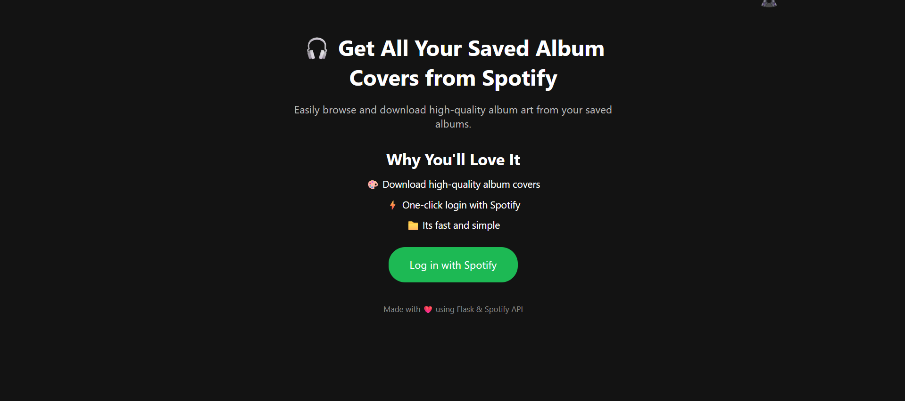
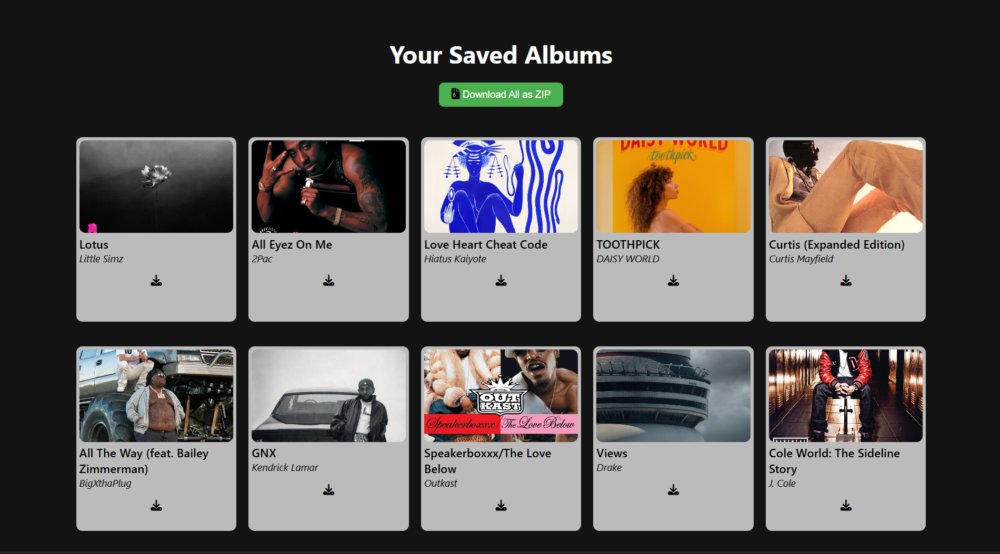

# 🎵 CoverFetch

**CoverFetch** is a simple web application that allows users to view and download the cover art of their saved albums on Spotify.

## 🔗 Live Demo

👉[CoverFetch](https://coverfetch.onrender.com/)

⚠️ Note:
Due to Spotify’s developer guidelines, this app is currently in development mode and not public-facing.
This means only whitelisted Spotify accounts can actually use the hosted version above.

If you’d like to use it yourself, you can clone the repository and run it locally with your own Spotify developer credentials [Usage](#usage).

 ---

Users can:
- View all their saved albums in a clean grid layout.
- Download individual album covers as JPG files.
- Bulk download all album covers as a single ZIP file.

---

## 🚀 Features

- ✅ Spotify OAuth Login
- 🎨 Display of saved albums with cover images, titles, and artists
- ⬇️ Individual image download (JPG format)
- 📦 Bulk download all covers as a single ZIP
- ❤️ Clean, mobile-friendly UI

---

## 🛠️ Tech Stack

- **Backend:** Flask (Python)
- **Frontend:** HTML, CSS, JavaScript
- **API:** Spotify Web API

---

## 🧰 Usage

1. **Clone this repository**
- create a folder and navigate to it in a terminal
- enter the following commands

   ```bash
   git clone https://github.com/ItsTachie/CoverFetch.git
   cd CoverFetch
   ```

2. **Install dependencies**

   ```bash
   pip install -r requirements.txt
   ```

3. **Set up your Spotify Developer credentials**

   * Register an app on the [Spotify Developer Dashboard](https://developer.spotify.com/dashboard).
   * Set your redirect URI to `http://localhost:5000/redirect`.
   * Add your **Client ID** and **Client Secret** to a `.env` file:


    CLIENT_ID={your spotify client id here}
    CLIENT_SECRET={your spotify client secret here}
    REDIRECT_URI=http://localhost:5000/redirect


4. **Run the application**

   ```bash
   python app.py
   ```

5. **Log in with your Spotify account**
   * Open your browser to `http://localhost:5000`.
   * Log in via Spotify and authorize the app.
   * Browse and download your saved album covers!

---

## 📷 Screenshots

 
 

---

