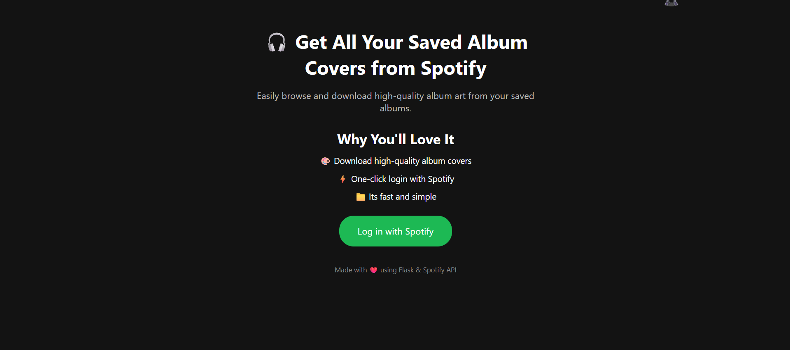

# 🎵 CoverFetch

**CoverFetch** is a simple web application that allows users to view and download the cover art of their saved albums on Spotify.

## 🔗 Live Demo

👉[CoverFetch]()

 ---

Users can:
- View all their saved albums in a clean grid layout.
- Download individual album covers as JPG files.
- Bulk download all album covers as a single ZIP file.

---

## 🚀 Features

- ✅ Spotify OAuth Login
- 🎨 Display of saved albums with cover images, titles, and artists
- ⬇️ Individual image download (JPG format)
- 📦 Bulk download all covers as a single ZIP
- ❤️ Clean, mobile-friendly UI

---

## 🛠️ Tech Stack

- **Backend:** Flask (Python)
- **Frontend:** HTML, CSS, JavaScript
- **API:** Spotify Web API

---

## 📷 Screenshots

 
 

---

